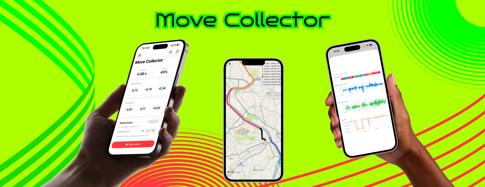

# MoveCollector

App for Undergraduate final project (PFG)



## Overview

MoveCollector (`MotionApp`) is an iOS app for **continuous collection and analysis of motion sensor data**. It records data from the device's accelerometer, gyroscope, and GPS in real time — including in the background — and processes it on-device to segment activity into movement "episodes".

Main features:

- **Real-time sensor capture** — accelerometer (m/s²), gyroscope (rad/s), and location, with live readouts and battery monitoring.
- **Continuous background collection** — keeps recording while the app is backgrounded via background processing, fetch, and location modes.
- **Episode segmentation / clustering** — groups the recorded stream into a configurable number of movement episodes (K), with map and chart visualizations.
- **Audio labeling** — record a short voice note per episode; on-device speech recognition suggests a label automatically.
- **CSV export** — export raw and combined sensor sessions for offline analysis.
- **Session recovery** — recover collections persisted to disk (e.g. after a background task ends).

Data is persisted locally with Core Data.

## Requirements

- **macOS** with **Xcode 26** or later
- **iOS 26.0+** target device or simulator (the main app is gated behind `@available(iOS 26.0, *)`)
- Swift 5.0
- An Apple developer signing team (required to run on a physical device)

The app requests the following device permissions at runtime:

- **Location** (When In Use / Always) — continuous data collection, including in the background
- **Microphone** — recording voice notes to label episodes
- **Speech Recognition** — on-device transcription of voice notes

## Try the beta (TestFlight)

Want to test MoveCollector on your own device? Join the public beta via TestFlight:

**[Join the MoveCollector beta →](https://testflight.apple.com/join/xve6nh1q)**

1. Install [TestFlight](https://apps.apple.com/app/testflight/id899247664) on your iPhone, iPad, or Mac.
2. Open the link above on your device and tap **Accept**, then **Install**.

## Running the app

1. Clone the repository:

```bash
git clone https://github.com/lariokabayashi/MoveCollector.git
cd MoveCollector
```

2. Open the project in Xcode:

```bash
open MotionApp.xcodeproj
```

3. Select the **MotionApp** scheme and choose a target:
   - An **iOS 26+ Simulator**, or
   - A **physical device** running iOS 26+ (set your signing team under *Signing & Capabilities* first).

4. Build and run with **⌘R**.

> Note: Sensor collection (accelerometer, gyroscope) and background/location features are best tested on a **physical device**, as the Simulator does not provide real motion data.

### Running from the command line (optional)

```bash
xcodebuild -project MotionApp.xcodeproj \
  -scheme MotionApp \
  -destination 'platform=iOS Simulator,name=iPhone 16 Pro' \
  build
```

## Author

Larissa Ayumi Okabayashi

## License

This project is licensed under the MIT License - see the [LICENSE](LICENSE) file for details.

Copyright (c) 2025-2026 Larissa Ayumi Okabayashi
